# OS-EX-1-Assembling-the-System---CASE-STUDY

## AIM:
To assemble the components of the computer.

## PROCEDURE:
1.Open the case:The First Step In Assembling A Computer Is To Open The Computer Case. To Open The Case, First Remove The Screws Of The Left Side Cover And Slide The Side Cover.
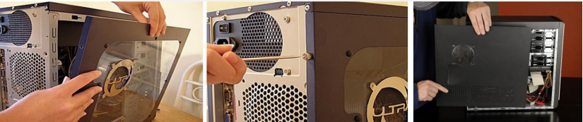
2.Install the power supply:The next step is to install a power supply. There are usually four screws that attach the power supply to the case.
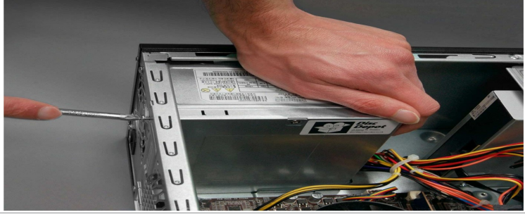
3.Attach the components to motherboard : The motherboard has to be prepared before its installation. To prepare the motherboard,you first need to install the CPU, then the Heat Sink on the CPU and CPU fan.A CPU socket uses a series of pins to connect a CPU’s processor to the Pc’s motherboard. If a CPU is connected via a CPU socket.
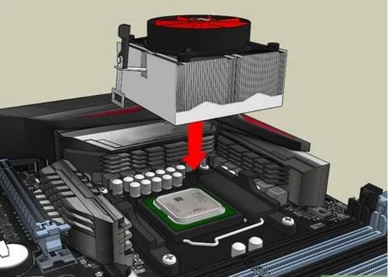
4.A CPU socket uses a series Of pins to connect a CPU’s processor to the Pc’s motherboard. If a CPU is connected via a CPU socket.
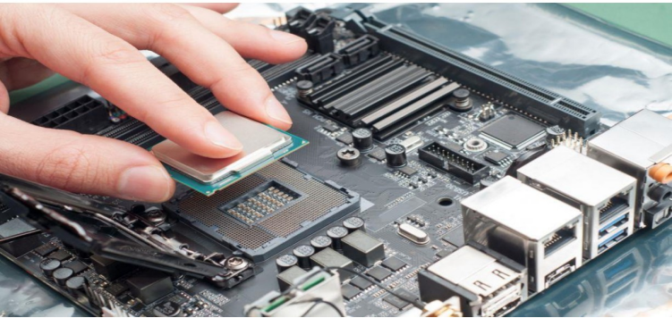
5.Heat sink and fan assembly : A HeatSink And Fan (HSF) Is An Active Cooling Solution Used To Cool Down Integrated Circuits In Computer Systems, Commonly The Central Processing Unit (CPU).
6.Connect The Assembly Power Cable To The CPU Fan Connector On The Motherboard.
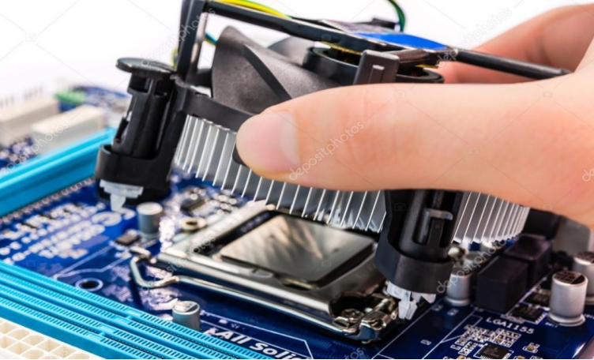
7.Installation of RAM:To Install The RAM First On The Motherboard And Then Fix The Motherboard In The Case. To Install RAM, First Ensure Its Compatibility With The Motherboard.
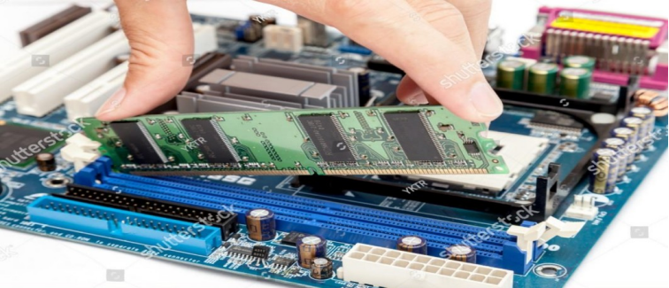
8.Install motherboard : After Preparing The Motherboard, You Can Install In The Computer Case.
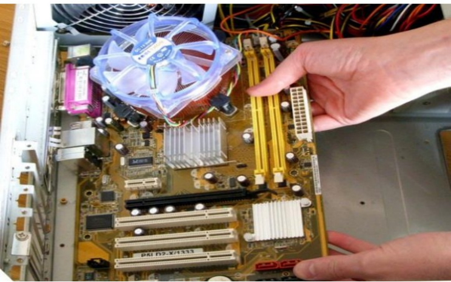
9.Install internal drives: The Hard Drive Is The Device Which Stores All The Data. Connect The Power Cable Coming From The SMPS To The Power Socket Of Hard Disk Drive. Connect SATA Data Cable From Hard Disk Drive Socket To The Motherboard Socket.
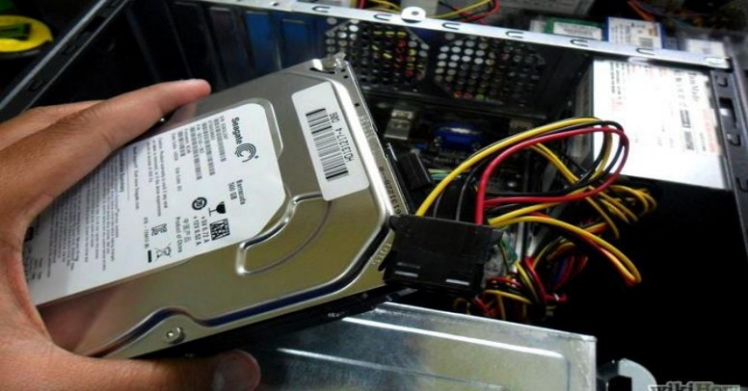
10.Connect all internal cables:Power Cables Are Used To Distribute Electricity From The Power Supply To The Motherboard And Other Components. Data Cables Transmit Data Between The Motherboard And Storage Devices, Such As Hard Drives.
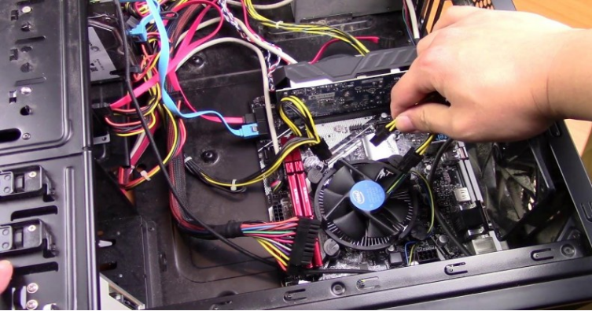
10.Install motherboard power connections:The Advanced Technology Extended (ATX) Main Power Connector Will Have Either 20 Or 24 Pins.
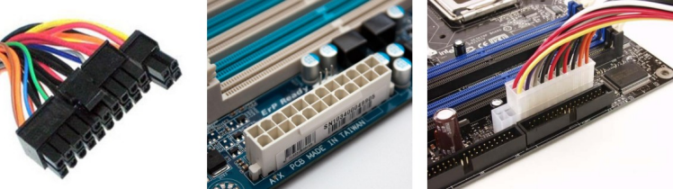
11.Connect external cables to the computer.The VGA Cable Is Used To Connect To Monitor.
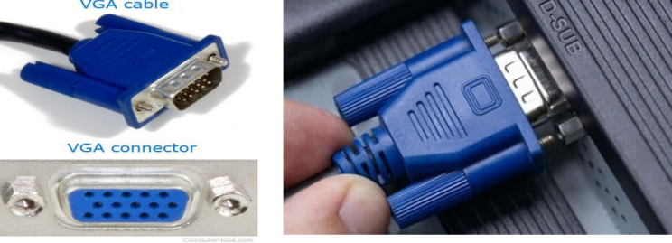
12.Push the power button to start the computer.
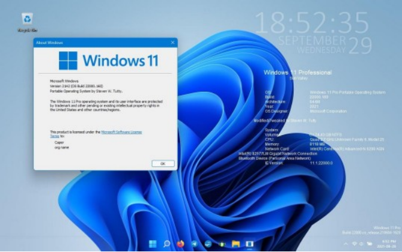

## RESULT:
Hence ,the system is successfully set up.
